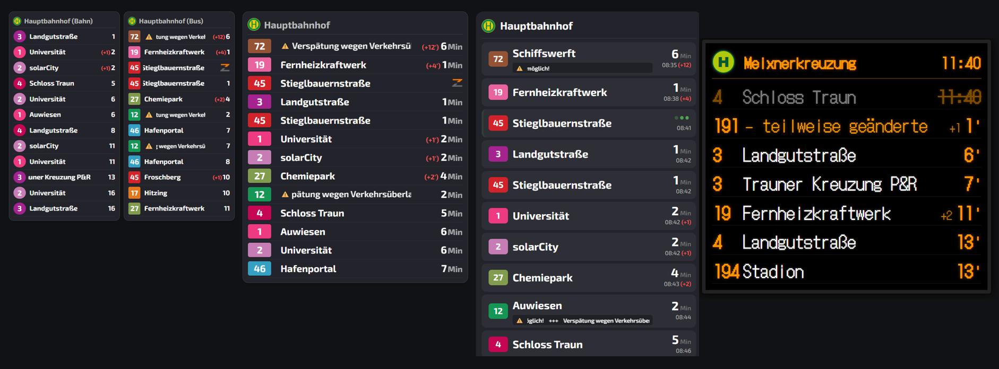
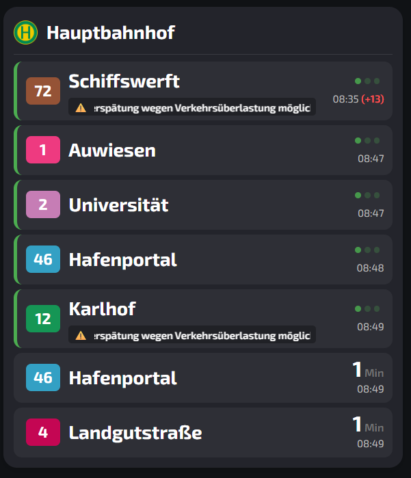
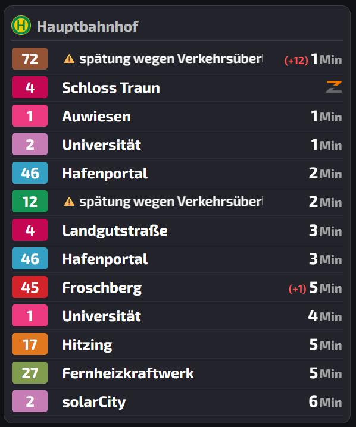
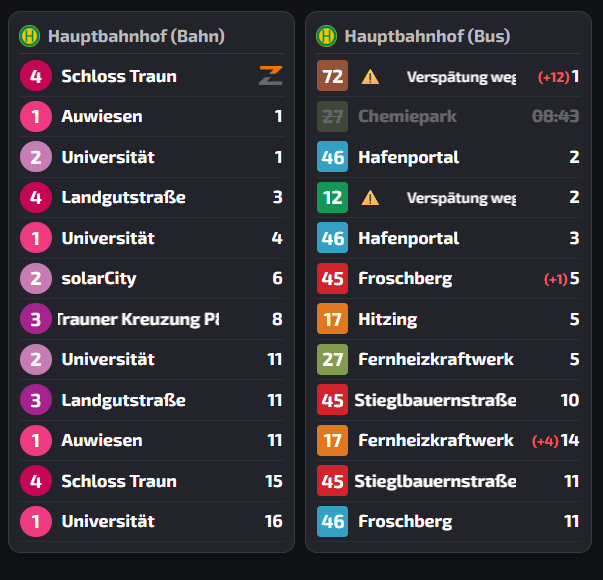
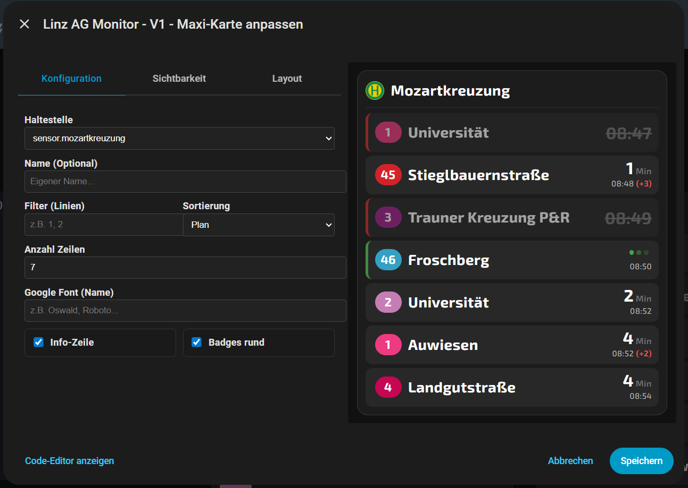
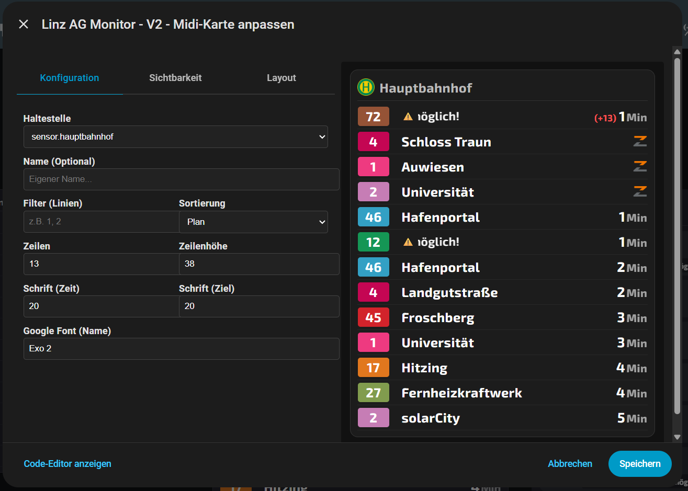
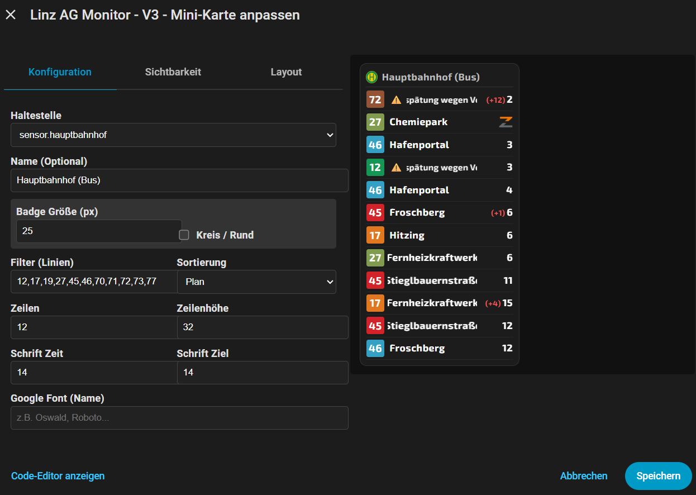

# 🚋 Linz Linien Abfahrtsmonitor

  <b>Der moderne Abfahrtsmonitor für Home Assistant.</b> 
  Live-Daten der Linz AG Linien, einfache Einrichtung und wunderschöne Dashboard-Karten.

---

## ✨ Features

* **⚡ Echtzeit-Daten:** Direkte Anbindung an die Schnittstelle der Linz AG.
* **🔍 Smart Search:** Suche einfach nach "Hauptplatz" oder "Goethekreuzung" – keine kryptischen IDs nötig!
* **🎨 3 Design-Varianten:** Wähle zwischen "Mini", "Midi" und "Maxi".
* **📱 Responsive:** Perfekt für Wall-Tablets und Smartphones.
* **⚙️ UI Config:** Vollständige Einrichtung über die Home Assistant Benutzeroberfläche.

---

## 🖼️ Vorschau

Die Integration kommt mit drei vorgefertigten Designs für dein Dashboard:

| Design V1 (Maxi) | Design V2 (Midi) | Design V3 (Mini) |
| :---: | :---: | :---: |
| *Maxiversion* | *Midiversion* | *Miniversion* |
|  |  |  |

---

## 📥 Installation

### Option 1: Via HACS (Empfohlen)

1.  Öffne HACS in Home Assistant.
2.  Gehe zu **Integrationen** > **Menü (drei Punkte)** > **Benutzerdefinierte Repositories**.
3.  Füge diese URL ein:
    `https://github.com/irmscher123/linz-linien-abfahrtsmonitor`
4.  Wähle die Kategorie **Integration**.
5.  Klicke auf **Hinzufügen** und dann auf **Herunterladen**.
6.  **Start Home Assistant neu.**

### Option 2: Manuell

1.  Lade das Repository als ZIP herunter.
2.  Kopiere den Ordner `custom_components/linz_ag_monitor` in deinen `/config/custom_components/` Ordner.
3.  Starte Home Assistant neu.

---

## ⚙️ Einrichtung

### 1. Sensor hinzufügen
Gehe zu **Einstellungen** > **Geräte & Dienste** > **Integration hinzufügen** und suche nach **Linz Linien Abfahrtsmonitor**.

1.  Gib den Namen der Haltestelle ein (z.B. `Simonystraße`).
2.  Wähle den korrekten Treffer aus der Liste.
3.  Fertig! Du hast nun einen Sensor (z.B. `sensor.simonystrasse`).

---

## 2. 🛠️ Manuelle Einrichtung der Karten

*Hinweis: Dies ist meist nur nötig, wenn die Karten nach der Installation nicht automatisch erscheinen.*

**Schritt 2.1: Dateien kopieren**
1. Lade die Dateien `linz-monitor-card_v1.js` , `linz-monitor-card_v2.js` und `linz-monitor-card_v3.js` aus dem Ordner `dashboard-cards` dieses Repositories herunter.
2. Lade sie in deinen Home Assistant Ordner: `/config/www/` hoch.
   *(Hinweis: Wenn der Ordner `www` nicht existiert, erstelle ihn. Danach Home Assistant neu starten!)*

**Schritt 2.2: Ressource registrieren**
Damit Home Assistant die Dateien kennt:
1. Gehe zu **Einstellungen** > **Dashboards**.
2. Klicke oben rechts auf die drei Punkte `...` und wähle **Ressourcen**.
3. Klicke auf **Ressource hinzufügen**.
4. Trage folgendes ein (wiederhole es für beide Versionen):

| Einstellung | Wert für V1 | Wert für V2 | Wert für V3 |
| :--- | :--- | :--- |
| **URL** | `/local/linz-monitor-card_v1.js` | `/local/linz-monitor-card_v2.js` | `/local/linz-monitor-card_v3.js` |
| **Art** | JavaScript Modul | JavaScript Modul |

3. Klicke auf **Erstellen**.

---

### 3. Dashboard Karte hinzufügen

Du musst keinen Code schreiben! Die Karten sind im Paket enthalten.

1.  Gehe auf dein Dashboard und klicke auf **Karte hinzufügen**.
2.  Suche oben in der Lupe nach "Linz".
3.  Wähle dein Design (**V1**, **V2** oder **V3**), wie hier zu sehen:

4.  Wähle im Editor deinen Sensor aus. Fertig!

### 🛠️ Karte bearbeiten (Editor)
Du kannst die Einstellungen (Titel, Sensor, etc.) ganz einfach über den visuellen Editor ändern:

| Editor V1 | Editor V2 | Editor V3 |
| :---: | :---: | :---: |
|  |  |  |

---

## ⚖️ Disclaimer & Datenquelle

**Datenquelle:**
Die Abfahrtszeiten werden von der öffentlichen Schnittstelle der Linz Linien GmbH (`linzag.at/efa`) abgerufen.

**Haftungsausschluss:**
Dies ist ein privates, inoffizielles Projekt und steht in keiner Verbindung zur Linz AG.
Der Entwickler übernimmt **keine Gewährleistung** für die Richtigkeit, Vollständigkeit oder Aktualität der angezeigten Daten. Sollte die Schnittstelle der Linz AG geändert werden oder ausfallen, kann die Funktion der Integration nicht garantiert werden.

---

## 🛠️ Credits & Lizenz

Entwickelt von **@irmscher123**.

[Lizenz: MIT](LICENSE)

# 🚋 Linz Lines Departure Monitor

  <b>The modern departure monitor for Home Assistant.</b> 
  Live data from Linz AG Lines, easy setup, and beautiful dashboard cards.

---

## ✨ Features

* **⚡ Real-time Data:** Direct connection to the Linz AG interface.
* **🔍 Smart Search:** Simply search for "Hauptplatz" or "Goethekreuzung" – no cryptic IDs needed!
* **🎨 3 Design Variants:** Choose between "Mini", "Midi", and "Maxi".
* **📱 Responsive:** Perfect for wall tablets and smartphones.
* **⚙️ UI Config:** Full setup via the Home Assistant user interface.

---

## 🖼️ Preview

The integration comes with three pre-built designs for your dashboard:

| Design V1 (Maxi) | Design V2 (Midi) | Design V3 (Mini) |
| :---: | :---: | :---: |
| *Maxi Version* | *Midi Version* | *Mini Version* |
|  |  |  |

---

## 📥 Installation

### Option 1: Via HACS (Recommended)

1.  Open HACS in Home Assistant.
2.  Go to **Integrations** > **Menu (three dots)** > **Custom Repositories**.
3.  Paste this URL:
    `https://github.com/irmscher123/linz-linien-abfahrtsmonitor`
4.  Select category **Integration**.
5.  Click **Add** and then **Download**.
6.  **Restart Home Assistant.**

### Option 2: Manual

1.  Download the repository as a ZIP file.
2.  Copy the folder `custom_components/linz_ag_monitor` into your `/config/custom_components/` directory.
3.  Restart Home Assistant.

---

## ⚙️ Setup

### 1. Add Sensor
Go to **Settings** > **Devices & Services** > **Add Integration** and search for **Linz Linien Abfahrtsmonitor**.

1.  Enter the stop name (e.g., `Simonystraße`).
2.  Select the correct match from the list.
3.  Done! You now have a sensor (e.g., `sensor.simonystrasse`).

---

## 2. 🛠️ Manual Card Setup

*Note: This is usually only necessary if the cards do not appear automatically after installation.*

**Step 2.1: Copy Files**
1. Download the files `linz-monitor-card_v1.js`, `linz-monitor-card_v2.js`, and `linz-monitor-card_v3.js` from the `dashboard-cards` folder of this repository.
2. Upload them to your Home Assistant folder: `/config/www/`.
   *(Note: If the `www` folder does not exist, create it. Restart Home Assistant afterwards!)*

**Step 2.2: Register Resource**
To make Home Assistant aware of the files:
1. Go to **Settings** > **Dashboards**.
2. Click the three dots `...` in the top right corner and select **Resources**.
3. Click **Add Resource**.
4. Enter the following (repeat for all versions):

| Setting | Value for V1 | Value for V2 | Value for V3 |
| :--- | :--- | :--- | :--- |
| **URL** | `/local/linz-monitor-card_v1.js` | `/local/linz-monitor-card_v2.js` | `/local/linz-monitor-card_v3.js` |
| **Type** | JavaScript Module | JavaScript Module | JavaScript Module |

3. Click **Create**.

---

### 3. Add Dashboard Card

No code needed! The cards are included in the package.

1.  Go to your dashboard and click **Add Card**.
2.  Search for "Linz" in the magnifying glass icon.
3.  Select your design (**V1**, **V2**, or **V3**), as shown here:

4.  Select your sensor in the editor. Done!

### 🛠️ Edit Card (Editor)
You can easily change settings (Title, Sensor, etc.) via the visual editor:

| Editor V1 | Editor V2 | Editor V3 |
| :---: | :---: | :---: |
|  |  |  |

---

## ⚖️ Disclaimer & Data Source

**Data Source:**
Departure times are retrieved from the public interface of Linz Linien GmbH (`linzag.at/efa`).

**Disclaimer:**
This is a private, unofficial project and is not affiliated with Linz AG.
The developer assumes **no warranty** for the accuracy, completeness, or timeliness of the displayed data. If the Linz AG interface changes or goes offline, the functionality of this integration cannot be guaranteed.

---

## 🛠️ Credits & License

Developed by **@irmscher123**.

[License: MIT](LICENSE)
