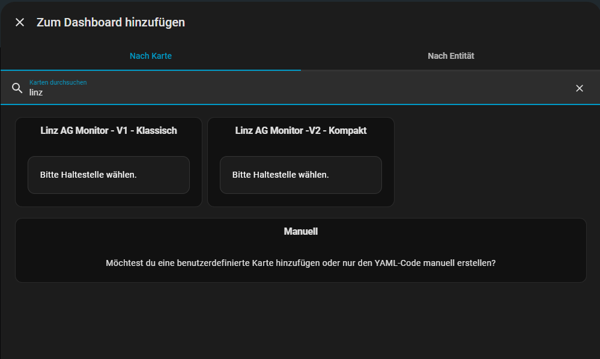

# 🚋 Linz Linien Abfahrtsmonitor

  

  <b>Der moderne Abfahrtsmonitor für Home Assistant.</b> 
  Live-Daten der Linz AG Linien, einfache Einrichtung und wunderschöne Dashboard-Karten.

---

## ✨ Features

* **⚡ Echtzeit-Daten:** Direkte Anbindung an die Schnittstelle der Linz AG (EFA).
* **🔍 Smart Search:** Suche einfach nach "Hauptplatz" oder "Goethekreuzung" – keine kryptischen IDs nötig!
* **🎨 2 Design-Varianten:** Wähle zwischen "Classic" (V1) und "Compact" (V2).
* **📱 Responsive:** Perfekt für Wall-Tablets und Smartphones.
* **⚙️ UI Config:** Vollständige Einrichtung über die Home Assistant Benutzeroberfläche.

---

## 🖼️ Vorschau

Die Integration kommt mit zwei vorgefertigten Designs für dein Dashboard:

| Design V1 (Classic) | Design V2 (Compact) |
| :---: | :---: |
| *Große Anzeige mit Linienfarben* | *Modern, platzsparend mit Lauftext* |
|  |  |

*(Hinweis: Damit diese Bilder erscheinen, lade Screenshots deiner Karten als `card_v1.png` und `card_v2.png` in den Ordner `pictures` hoch!)*

---

## 📥 Installation

### Option 1: Via HACS (Empfohlen)

1.  Öffne HACS in Home Assistant.
2.  Gehe zu **Integrationen** > **Menü (drei Punkte)** > **Benutzerdefinierte Repositories**.
3.  Füge diese URL ein:
    `https://github.com/irmscher123/linz-linien-abfahrtsmonitor`
4.  Wähle die Kategorie **Integration**.
5.  Klicke auf **Hinzufügen** und dann auf **Herunterladen**.
6.  **Start Home Assistant neu.**

### Option 2: Manuell

1.  Lade das Repository als ZIP herunter.
2.  Kopiere den Ordner `custom_components/linz_ag_monitor` in deinen `/config/custom_components/` Ordner.
3.  Starte Home Assistant neu.

---

## ⚙️ Einrichtung

### 1. Sensor hinzufügen
Gehe zu **Einstellungen** > **Geräte & Dienste** > **Integration hinzufügen** und suche nach **Linz Linien Abfahrtsmonitor**.

1.  Gib den Namen der Haltestelle ein (z.B. `Simonystraße`).
2.  Wähle den korrekten Treffer aus der Liste.
3.  Fertig! Du hast nun einen Sensor (z.B. `sensor.simonystrasse`).

### 2. Dashboard Karte hinzufügen

Du musst keinen Code schreiben! Die Karten sind im Paket enthalten.

1.  Gehe auf dein Dashboard und klicke auf **Karte hinzufügen**.
2.  Suche oben in der Lupe nach "Linz".
3.  Wähle dein Design (**V1** oder **V2**), wie hier zu sehen:

4.  Wähle im Editor deinen Sensor aus. Fertig!

---

## 🛠️ Credits & Lizenz

Entwickelt von **@irmscher123**.
Datenbereitstellung durch Linz AG. Dies ist ein inoffizielles Projekt.

[Lizenz: MIT](LICENSE)
